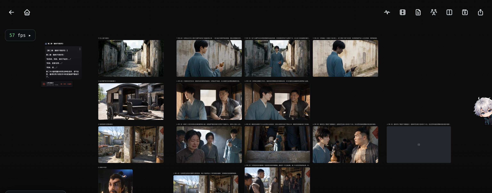
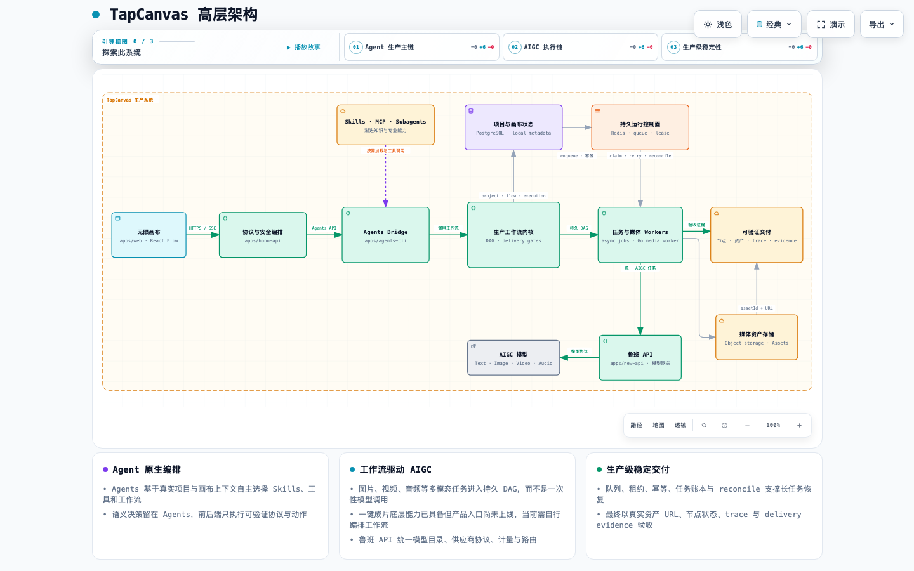

<p align="center">
  
</p>

<p align="center">
  面向 AI 影视、漫剧与多模态内容生产的 Agent 原生无限画布
</p>

<p align="center">
  <a href="https://github.com/anymouschina/TapCanvas/stargazers"></a>
  <a href="./LICENSE"></a>
  
  
</p>

# TapCanvas 社区版

TapCanvas 把创意、脚本、角色与场景资产、分镜、图像、视频和最终成片放进同一个可追溯的画布工作流。它不是单次模型调用器：Agents 会读取真实项目与画布状态，自主选择 Skills 和工具，执行多步生产，并以节点、资产和运行记录交付结果。在线网站核心功能及样式与当前项目完全一致，截止 26.8.31。

> **版本边界：** 本仓库是 TapCanvas 社区版，在线商业版是独立产品，功能、服务与条款均不相同。社区版不提供短信验证码与在线支付；模型渠道由使用者自行配置。

<p align="center">
  
</p>

## 核心能力

- **无限画布**：用强类型节点、端口和连线组织文档、角色、分镜、图像、视频、音频、字幕与工作流。
- **Agent 原生执行**：`POST /public/agents/chat` 统一进入 DeepSeek Harness Bridge，由 Agents 负责语义理解、规划、Skills、子代理与最终交付自检。
- **成片生产底座（需编排）**：支持章节上下文、角色/场景资产、结构化分镜、连续镜头、首尾帧承接、视频生成与合成；固定的一键成片入口尚未上线。
- **多模型网关**：文本、图像、视频和音频模型由鲁班 API（`apps/new-api`）统一接入、计量和动态下发，前端不写死模型列表。
- **项目化资产**：素材库、版本、生成历史、任务状态、交付证据与项目本地元数据持续沉淀，生成成功的资产不会被后处理丢弃。
- **工作流与协作**：支持可复用 DAG、异步 Worker、失败恢复、分享/发布、团队作用域与实时画布状态。

## 当前架构

<p align="center">
  <a href="./docs/tapcanvas-high-level-architecture.html">
    
  </a>
</p>

主链路是 **无限画布 → Agents Bridge → 生产工作流内核 → 任务与媒体 Workers → 可验证交付**。Agents 根据真实项目状态按需调用 Skills、MCP、子代理与工作流；图片、视频和音频任务经鲁班 API 进入 AIGC 模型，再由任务账本、队列、租约、幂等、重试与 reconcile，以及真实资产 URL 和 delivery evidence，保证长链路生产可恢复、可追溯、可验收。

> **一键成片边界：** 底层 AIGC、工作流编排、异步执行与交付验收能力已经具备，但固定的一键成片产品入口尚未上线，当前需要自行编排工作流。点击架构图可打开带导览与节点说明的交互版本。

Monorepo 的职责边界：`apps/web` 负责交互与确定性画布执行，`apps/hono-api` 负责协议、权限、任务与事实证据，`apps/agents-cli` 是 DeepSeek Harness 的 TapCanvas Bridge，`apps/new-api` 负责模型网关，`packages/schemas` 保存前后端共享契约。AI 对话架构细节见 [apps/hono-api/README.md](./apps/hono-api/README.md)，Bridge 说明见 [apps/agents-cli/README.md](./apps/agents-cli/README.md)。

## 快速开始

需要 Docker + Docker Compose、Node.js `^22.19.0` 或 `>=24`、pnpm `10.8.1`。

```bash
git clone https://github.com/anymouschina/TapCanvas.git
cd TapCanvas
corepack enable
pnpm -w install

cp apps/hono-api/.env.example apps/hono-api/.env
cp apps/web/.env.example apps/web/.env
# 按模板注释补齐必填密钥后，启动后端、数据库、网关、Agents 与 Workers
docker compose up -d --build

# 另开终端启动 Web
pnpm dev:web
```

打开 Web [http://localhost:5175](http://localhost:5175)，API 位于 [http://localhost:8788](http://localhost:8788)，鲁班 API 管理台位于 [http://localhost:4455](http://localhost:4455)。全新数据库的 Canvas 管理员默认为 `admin / 123456`，仅用于本机首次启动；暴露到局域网或公网前必须修改。

### 环境变量

README 不复制整份配置，避免与代码漂移；[API 模板](./apps/hono-api/.env.example) 和 [Web 模板](./apps/web/.env.example) 是唯一入口。首次启动只需确认以下分组：

| 分组     | 关键变量                                                                                                         |
| -------- | ---------------------------------------------------------------------------------------------------------------- |
| 数据库   | `POSTGRES_DB`、`POSTGRES_USER`、`POSTGRES_PASSWORD`、`DATABASE_URL_DOCKER`                               |
| 服务鉴权 | `JWT_SECRET`、`INTERNAL_WORKER_TOKEN`、`AGENTS_BRIDGE_TOKEN`                                               |
| 模型网关 | `NEW_API_INTERNAL_TOKEN`、`NEW_API_SESSION_SECRET`、`NEW_API_CRYPTO_SECRET`、`NEW_API_USD_EXCHANGE_RATE` |
| Web      | `VITE_API_BASE`；GitHub OAuth 与对象存储按模板启用                                                             |

模型供应商凭据在鲁班 API 管理台配置；不要把真实密钥提交到 Git。缺失关键配置会显式失败，不会自动选择默认模型或静默降级。

```bash
pnpm build          # Web + API + Agents
pnpm test           # 全量测试
docker compose ps   # 服务状态
docker compose down # 停止服务，不删除数据卷
```

## 许可证

TapCanvas 根项目及未另行声明的代码按 [MIT License](./LICENSE) 发布。`apps/new-api` 是独立上游衍生组件，继续适用其目录中的 [GNU AGPL-3.0 License](./apps/new-api/LICENSE) 与原始归属声明；其他第三方组件分别适用各自许可证。在线商业版不适用本仓库协议。

## 感谢贡献者

感谢每一位通过代码、文档、Issue、评审、测试与使用反馈帮助 TapCanvas 持续完善的贡献者。

<p align="center">
  <a href="https://github.com/anymouschina/TapCanvas/graphs/contributors">
    
  </a>
</p>

每一次贡献都在帮助社区版变得更统一、更稳定，也让多模态内容生产工作流能够服务更多创作者。欢迎阅读现有 Issues、提交修复或分享你的工作流实践。

## 作者与反馈

作者：**Beq（李碧强）** · 邮箱：[beq.li@qq.com](mailto:beq.li@qq.com)


Bug、功能建议与贡献请通过 [Issues](https://github.com/anymouschina/TapCanvas/issues) 或 Pull Request 提交。

## Star 趋势

[](https://www.star-history.com/#anymouschina/TapCanvas&Date)

## 能力完成度与待办

### 已完成：剧本与分镜前置链路

- [X] **小说/剧本导入与章节锚定**：支持导入长文本并保存章节原文；章节画布以只读 `chapter-info` 节点保留标题与正文真源。
- [X] **剧本文档与资产沉淀**：`novelDoc` / `scriptDoc` 是可编辑、可保存、可进入项目素材库并可作为后续分镜与视频上游的正式节点类型。
- [X] **Agent 创建与改写剧本**：Agents 可通过统一画布补丁创建或更新 `scriptDoc`，把小说章节提炼成可继续人工编辑和下游消费的剧本文本。
- [X] **剧本拆解资产**：可从剧本/章节文本提取结构化角色并生成场景参考，形成带身份锚点的角色卡与场景卡。
- [X] **分镜脚本与分镜表**：同时支持纯文本 `storyboardScript` 和结构化 `shotTable`；后者可编辑镜号、时间、景别、机位、运镜、主体、动作、场景、光线与构图。
- [X] **对白与说话人合同**：视频 authoring 使用结构化 `speechEvents`、台词顺序与 `speakerBindings`，镜头通过事件 ID 引用对白，避免正文散落到视觉字段。
- [X] **章节分镜连续性与持久化**：`storyboardPlans` / `storyboardChunks` 写入项目元数据；续组严格读取直接前驱的真实 `tailFrameUrl`，缺失时显式失败。

<details>
<summary><strong>待办：图片与视频节点闭环（展开查看）</strong></summary>

### 图片与视频节点闭环

下面只记录已经存在产品入口或中间实现、但还没有完成端到端闭环的事项。这里的“闭环”是指：用户动作产生真实任务或资产，状态准确回填到原节点或明确的结果节点，结果进入 Assets 并持久化，刷新或服务重启后可恢复，取消与重试具有幂等语义，最后有自动化测试证明。仅仅没有配置某个第三方模型，不视为代码缺陷。

#### P0：图片与视频共用链路

- [ ] **统一持久任务与回收链路**：把图片转 3D、全景图、视频增强、去字幕和主体消除等仍由浏览器长轮询的动作接入统一任务账本；占位节点必须持久化 `taskId`，刷新页面、关闭标签页或服务重启后仍能由后端 reconcile 回填同一节点，且不得重复提交付费任务。
- [ ] **资产写入原子化**：图片/视频上传、编辑、合成和音视频分离只有在获得真实 HTTP(S) 资产 URL 与 `assetId` 后才允许进入成功态；禁止把 `blob:`、`data:` 或仅当前会话可见的本地预览保存成最终节点结果。上传或转存失败时应保留可诊断的失败状态与可执行重试入口。
- [ ] **模型目录硬切换**：图片转 3D、视频增强及其他媒体动作全部从系统模型目录按能力标签、规格与价格动态选择，移除前端写死的 vendor/model key；目录未加载、无精确能力或规格不匹配时原地显式失败。
- [ ] **取消、超时与重试闭环**：节点“停止”必须作用到真实在飞任务与轮询器；以 `taskId + runToken/幂等键` 隔离不同尝试，防止旧结果覆盖新任务。供应商已经成功产出的资产必须被回收和记录，不能因前端取消、超时或断连而丢失。
- [ ] **统一事实与诊断字段**：所有媒体结果都记录 `assetId`、`taskId`、来源节点、实际模型、执行规格、结果 URL 和失败原因；历史结果与主结果索引在保存、重载和协作同步后保持一致，错误信息不能只剩“生成失败，请稍后重试”。
- [ ] **能力驱动的操作入口**：图片/视频工具栏根据动态模型目录和本地执行器的真实能力展示或禁用操作，并说明缺失条件；禁止让用户进入一个最终只能提示“能力未接入”的编辑流程。

#### P1：图片节点

- [ ] **图片上传与批量结果一致性**：多图上传逐项落真实资产、逐项记录成功或失败，部分失败不能留下会在刷新后失效的本地 URL，也不能把失败项伪装成可供远程生成消费的图片节点。
- [ ] **图片转 3D 结果协议**：为 3D 资产补齐明确的结果类型、`assetId`、预览、下载、复用和下游端口契约，不再只把 `model3dUrl` 挂在普通 `kind=image` 节点的临时字段上。
- [ ] **图片派生操作统一验收**：裁剪、扩图、重绘、擦除、去噪、抠图、分层、多角度、打光、情绪、旋转与全景图统一经过“真实源图校验 → 占位状态 → 执行 → Assets 登记 → 结果节点/来源连线 → 失败可重试”验收，并补刷新恢复、上传失败和多结果主图切换测试。

#### P1：视频节点

- [ ] **多视频上传不覆盖历史**：连续或批量上传时必须基于节点最新状态追加 `videoResults`，为每个文件保存独立 `assetId` 与状态，并正确更新 `videoPrimaryIndex`；不能因闭包中的旧数组让后一个文件覆盖前一个结果。
- [ ] **音视频分离任务化**：将浏览器内 demux 升级为可恢复的媒体任务，支持大文件、进度、取消、失败重试与后台回填；无声视频和独立音轨都必须进入 Assets，并与源视频保持可追溯连线。
- [ ] **视频合成持久交付**：合成结果不能以临时 `blob:` URL 作为可交付成功态；转存失败后应由持久任务继续重试或明确失败，最终成片需有真实 URL、资产记录、来源片段/音轨清单和可验证的交付证据。
- [ ] **视频操作端到端测试**：为视频增强、智能/框选去字幕、主体消除、片段重拍、智能续写、首尾帧生成、截帧、音视频分离与合成补真实 handler/runner 契约测试，覆盖模型不可用、供应商失败、刷新恢复、取消、重复点击和成功资产回填。

</details>
